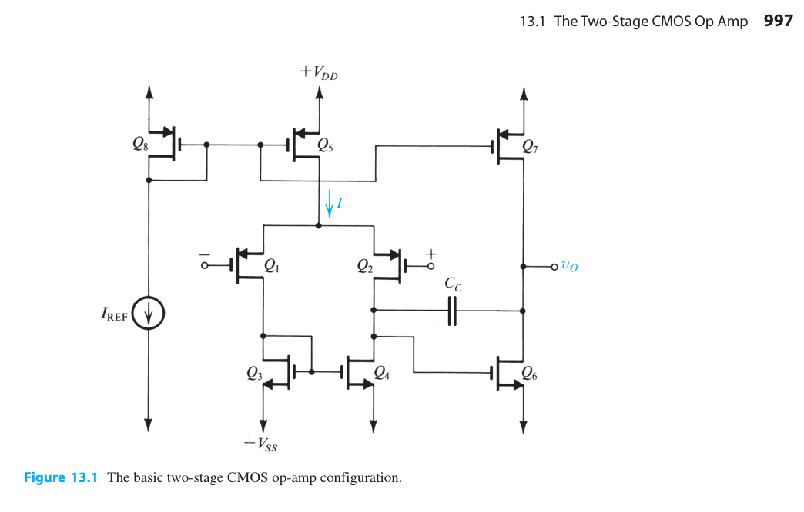

Μια πιο ευανάγνωστη εκδοχή του [ΒΑΣΙΚΕΣ ΕΞΙΣΩΣΕΙΣ ΗΛΕΚΤΡΟΝΙΚΗΣ ΙΙΙ](https://github.com/kolokythokeftedakia/microelectronics_3_cheatsheet/blob/main/BASIKES_EKSISOSEIS_HLEKTRONIKHS_3-2013.pdf)

Two stage CMOS operational amplifier schematic from Sedra, A. S., Smith, K. C. (2015). Microelectronic Circuits. United Kingdom: Oxford University Press.

